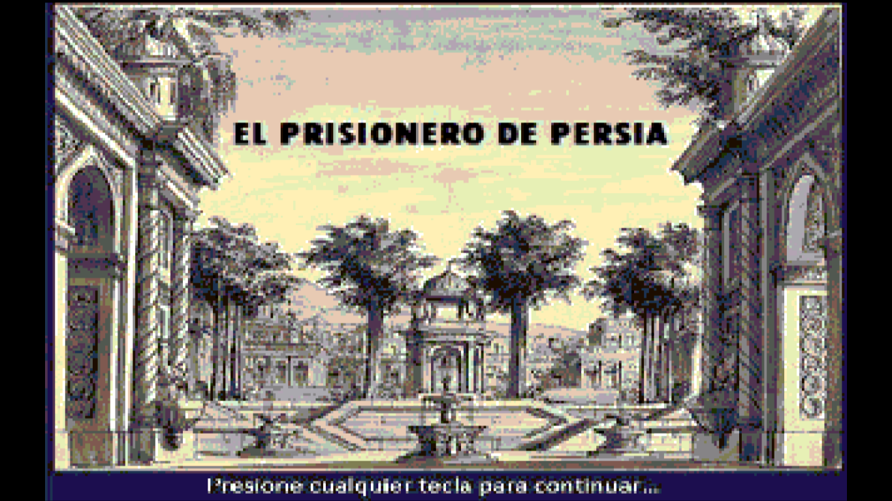

# Prisionero de Persia

Video juego creado en Assembly86

## Instalacion Maquina Virtual

1- Descargar el archivo maquinaVirtual.exe e instalarlo.              
2- Seguir las instrucciones.            
3- Descargar los archivos de la carpeta [src](src/persiah.bmp)      
4- Descargar el archivo [MAINGAME.EXE](MAINGAME.EXE)
5- Copiar los 2 archivos en la Carpeta Tasm. (EJEMPLO: C:\Tasm 1.4\Tasm)     
6- Ejecutar la maquina virtual
7- Tipear **maingame** para iniciar el juego

## Opcional: Creacion el .EXE

Con los archivos de la carpeta src adentro de la carpeta tasm hacer.

1- Ejecutar maquina virtual (icono manzanita)               
2- Ejecutar las siguientes instrucciones en la linea de comandos:               

**tasm maingame**          
**tasm libgame**           
**tlink maingame libgame**                     

3- Para ejecutar el juego tipear **maingame** y presionar ENTER

## Objetivo del juego

Este es un juego de ingenio y azar. Sos un prisionero que intenta escapar de un calabozo custodiado por muchos guardias.
Tu misión es explorar los distintos lugares en búsqueda de elementos que te ayuden a escapar:
- Recorre todos los lugares en busqueda de objetos clave.
- Piensa con cuidado por donde avanzar.
- Recorre nuevamente los lugares, quizas haya cambiado algo.
- Recolecta armas y escudos que te serviran en la batalla.
- El azar rige tu destino pero tambien tu inteligencia.
- Ten paciencia y lee con detenimiento todo los textos.

## Controles

- Este juego no tiene interfaz gráfica.
- Guiate con la numeración de los menú (similar a un cajero automático)
- IMPORTANTE: No utilices el teclado numerico ya que no reconocerá la teclas como numero.

## Comandos útiles (CONSOLA)

**cls:** Limpiar pantalla          
**Alt+ENTER:** Minimizar/Maximizar               
**arrowUp:** Tipea comando anterior               
